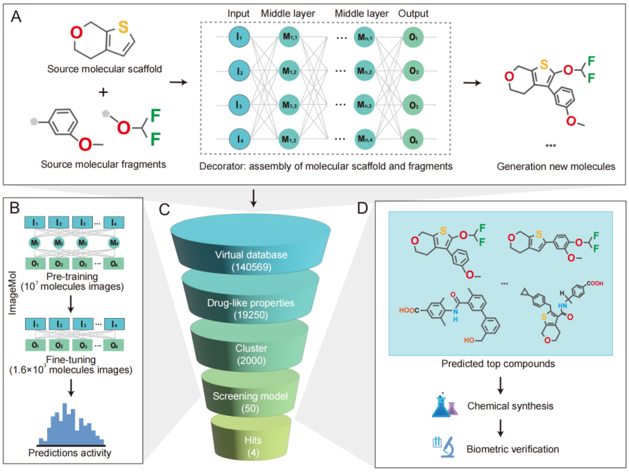

# LeadDisFlow PyTorch Implementation

---

<a href="https://github.com/HongxinXiang/ImageMol/blob/master/LICENSE">
    
</a>

**🚀 Discovery of EP4 antagonists with image-guided explainable deep learning workflow**

**🚀 Paper link:** XXXXXX


<div align="center">
  
</div>


## Installation
Download the code:
````
git clone https://github.com/mapengsen/LeadDisFlow.git
cd LeadDisFlow
````
A suitable [conda](https://conda.io/) environment named `LeadDisFlow` can be created and activated with:

````
conda env create -f environment.yml
````
```commandline
conda activate LeadDisFlow
```
&nbsp;

🔎 **Note:** LeadDisFlow is a general workflow for generating + screening target antagonists. Here, we take the BACE1 target as an example.

## 1️⃣First Step --> LeadDisFlow-G[Generaion Virtual compound library]
### 🪴🪴Train from compounds[Train molecules generation model]

**1) Slice the train datasets for train**
````
python slice_data2fragmentes.py --input_smiles_path data/BACE1_train_test.smi --output_smiles_path data/BACE1_train_test_fragments.smi
````

**2) Construct sliced datasets to muti-smi files**
````
python fragments2mutiSmi.py --i data/BACE1_train_test_fragments.smi --o data/train_fragments -n 50
````

**3) Traning empty model from one sliced smi files**
````
python create_emptyModel.py --i data/train_fragments/000.smi --o data/models/model.empty
````

**4) Begin training**
````
python train_model.py --i data/models/model.empty --o data/models/model.trained -s data/train_fragments --b 32
````


### 🪴🪴Inference from given compounds[Generation virtual compound library]

**1) Start generating the compound library.**
````
python slice_data2fragmentes.py --input_smiles_path data/BACE1_inference_test.smi --output_smiles_path data/BACE1_inference_test_fragments.smi
````
**2)Begin inference**
````
python sample_scaffolds.py -m data/models/model.trained.90 -i data/BACE1_inference_test_fragments.smi -o data/BACE1_inference_generated.csv -r 16 -n 16 -d multi --of csv 
````

**3) Remove invalid and duplicate compounds.**
```
python utils/del_dum_wrong.py -i data/BACE1_inference_generated.csv -o data/BACE1_inference_generated_valid.csv
```


&nbsp;

## 2️⃣Second Step --> AnDisFlow-S[Screen Virtual compound library]

**1) Screen model step 1:**
````
PYTHONPATH=. python models/screen_noModel.py --data data/BACE1_inference_generated_valid.csv --output data/BACE1_inference_generated_valid_Screen_cluster.csv
````

**2) Screen model step 2(Fintune the AnDisFlow-S model):**
 
🌈🌈 1. Fintune the AnDisFlow-S: Then, the image prediction model is fine-tuned and used to predict scores, resulting in the top 50.

Preprocess finetune(BACE1 labeled) dataset:

```
python models/ImageMol/data_process/smiles2img_pretrain.py --dataroot data/finetune_imagemol --dataset BACE1
```
Finetune imagemol model
````
python models/ImageMol/finetune.py --gpu 0 \
                   --save_finetune_ckpt 1 \
                   --log_dir data/logs/BACE1 \
                   --dataroot data/finetune_imagemol \
                   --dataset BACE1 \
                   --task_type classification \
                   --resume models/ImageMol/ckpts/ImageMol.pth.tar \
                   --image_aug \
                   --lr 0.00006 \
                   --batch 64 \
                   --epochs 40
````


🌈🌈 2. Use the screen datasets(Screen model step 1's datasets) and screen datasets and get the top50 molecules.


```
python models/ImageMol/data_process/smiles2img_pretrain.py --dataroot data --dataset BACE1_inference_generated_valid_Screen_cluster
```

```
python models/ImageMol/evaluate_predict.py \
--dataroot data --dataset BACE1_inference_generated_valid_Screen_cluster \
--task_type classification \
--resume data/logs/BACE1/valid_best.pth \
--batch 128 \
--output_file data/BACE1_predictions_results.csv
```

✅The last screen top 50 results in data/BACE1_predictions_results.csv


## Acknowledgments

---
* Zeng X, Xiang H, Yu L, et al. Accurate prediction of molecular properties and drug targets using a self-supervised image representation learning framework[J]. Nature Machine Intelligence, 2022, 4(11): 1004-1016.
* Arús-Pous, J. et al. SMILES-based deep generative scaffold decorator for de-novo drug design. J. Cheminformatics 12, 38 (2020).