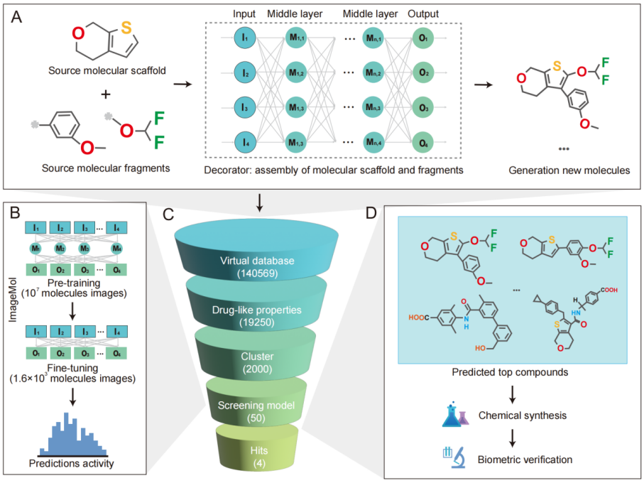

# LeadDisFlow PyTorch Implementation

---

<a href="https://github.com/HongxinXiang/ImageMol/blob/master/LICENSE">
    
</a>

**Discovery of EP4 antagonists with image-guided explainable deep learning workflow**
<div align="center">
  
</div>


## Installation
Download the code:
````
git clone https://github.com/mapengsen/LeadDisFlow.git
cd LeadDisFlow
````
A suitable [conda](https://conda.io/) environment named `LeadDisFlow` can be created and activated with:

````
conda env create -f environment.yaml
````
conda activate LeadDisFlow

## Prepare datasets for AnDisFlow
All the data is under the 'data' folder.

### 🪴🪴Inference from compounds[Generation Virtual compound library]

### 1) Start generating the compound library.
```commandline
python sample.py -m data/train/EP4_decorator/models/final_model -i data/inference/EP4_decorator/EP4_inference.smi \
-o data/results/EP4_inference_generated.csv -r 16 -n 16 -d multi --of csv -b 512
```

### 2) Remove invalid and duplicate compounds.
```commandline
python utils/del_dum_wrong.py
```

&nbsp;

## Second Step --> AnDisFlow-S[Screen Virtual compound library]

````
cd Screen
````
All screening data processes are in Screen/EP4_Screen.ipynb, and the post-screening data is stored in the DataForScreen folder.
```commandline
Screen/EP4_Screen.ipynb
```
### 🍏🍏Fintune the AnDisFlow-S
Then, the image prediction model is fine-tuned and used to predict scores, resulting in the top 50.

Use the data for screen in folder(DataForScreen), and download pre-trained self-supervised model and push it into the folder ckpts/
link: <https://drive.google.com/file/d/1wQfby8JIhgo3DxPvFeHXPc14wS-b4KB5/view>

Finetune:
````
python finetune.py --gpu ${gpu_no} \
                   --save_finetune_ckpt ${save_finetune_ckpt} \
                   --log_dir ${log_dir} \
                   --dataroot ${dataroot} \
                   --dataset ${dataset} \
                   --task_type ${task_type} \
                   --resume ${resume} \
                   --image_aug \
                   --lr ${lr} \
                   --batch ${batch} \
                   --epochs ${epoch}
````


More info about Imagemol, you can reference: <https://github.com/HongxinXiang/ImageMol>


## Acknowledgments

---
* Zeng X, Xiang H, Yu L, et al. Accurate prediction of molecular properties and drug targets using a self-supervised image representation learning framework[J]. Nature Machine Intelligence, 2022, 4(11): 1004-1016.
* Arús-Pous, J. et al. SMILES-based deep generative scaffold decorator for de-novo drug design. J. Cheminformatics 12, 38 (2020).